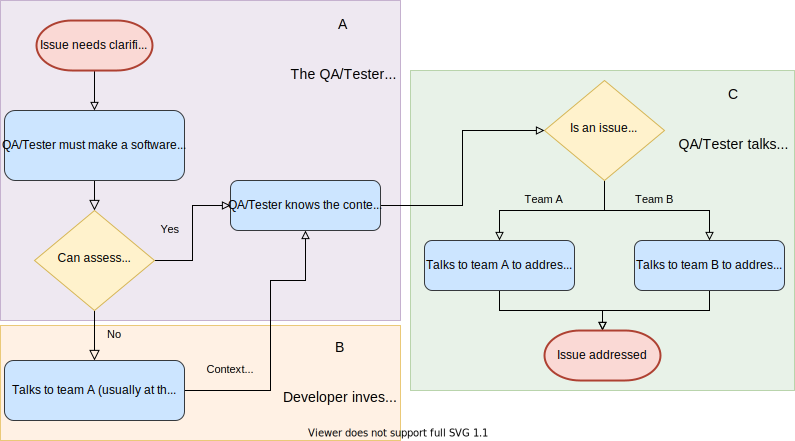

# Hermes

Hermes is an open source Android library that aims at increasing the overall team's productivity. It does so by empowering not-so-technical team members, such as QAs and Testers to more easily and independently perform software analysis. 
By empowering not-so-technical team members, the time developers have to dedicate clarifying behaviours or looking into issues that, turn out, can only be solved by another team, would decrease.

<h3 align="center">Usual issue analysis flowchart</h1>

  

Section A and C are inevitable, making it more likely to navigate from Section A to C, not having to pass by Section B, will result in an overall team productivity improvement.

# How do I use Hermes?

// Explaination on how to import
// Explaination on how to initialize
// Base usages

# More examples

// Show toasts
// Show data formatting, ect.

# Beta

// Brief explaination on why shares are usefull / show shares
